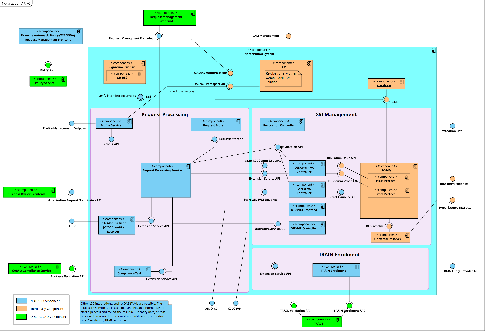

# Notarization-API

The purpose of the Notarization API is to provide an authorization officer a software component to attest given master data and transform it to a digital verifiable credential representation.

These tamper-proof digital claims about certain attributes are central to gaining the desired trust about provided self-descriptions of assets and participants in the distributed Gaia-X ecosystem.

The system provides APIs to integrate the notarization component smoothly in external software systems for Non-IT operator usage (e.g., lawyers, notaries, governments, certifiers ...).

## Documentation

An overview of the complete documentation can be found under [documentation/README.md](documentation/README.md).



## Quick start

### Running Locally via Docker Compose

```bash
$ ./scripts/ledger-management.sh start-ledger
$ docker compose -f deploy/local/docker-compose/bdd-tests.yml up
```

For more information, see [documentation/developer/install-docker-compose.md](./documentation/developer/install-docker-compose.md).
