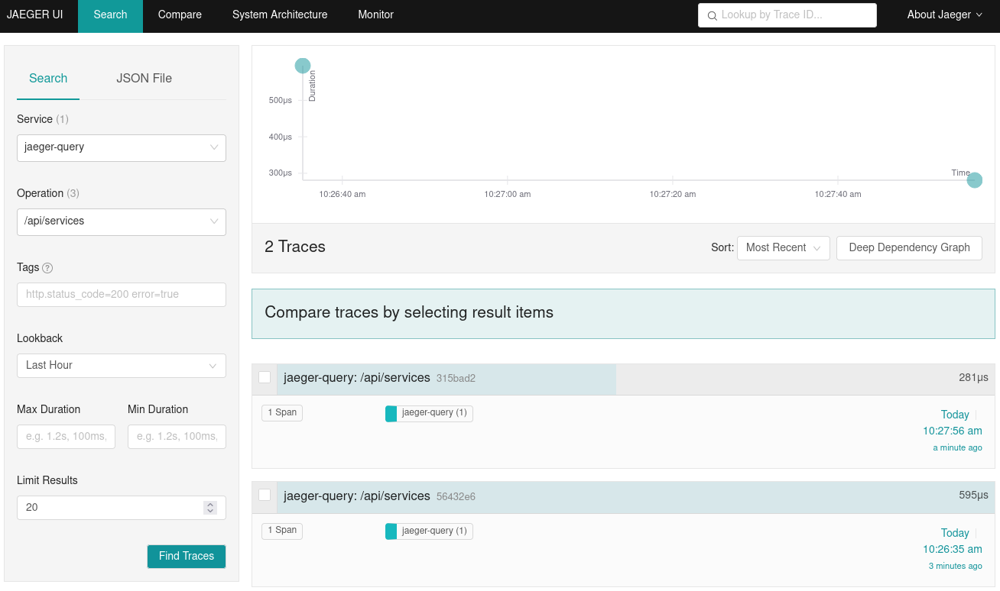

# Monitoring

<!-- TOC GitLab -->

- [Configuration](#configuration)
- [Collecting metrics](#collecting-metrics)
- [Alerting](#alerting)
- [Tracing](#tracing)
- [External references and documentation](#external-references-and-documentation)

<!-- /TOC -->

Prometheus is used as a monitoring and alerting solution. It is completely open
source, integrates well with other tools and fits natural into a microservice
oriented architecture.

The metrics of the external components of the stack can be collected with
publicly available `exporters`, e.g. for PostgreSQL, Keycloak and RabbitMQ.

For all custom Java (Quarkus) based services, the Micrometer metrics library is
used to scrape runtime and application metrics. An additional endpoint is
available for all services at `<protocol>://<host>:<port>/q/metrics`.

Example output of generated metrics:

```txt
# HELP http_server_requests_seconds
# TYPE http_server_requests_seconds summary
http_server_requests_seconds_count{method="GET",outcome="SUCCESS",status="200",uri="/example/prime/{number}",} 1.0
http_server_requests_seconds_sum{method="GET",outcome="SUCCESS",status="200",uri="/example/prime/{number}",} 0.017385896
```

The following snippet shows an example of how to collect custom metrics within
an application:

```java
package eu.gaiax.notarization.demo.application;

import io.micrometer.core.instrument.MeterRegistry;

public class MyService {
    private final MeterRegistry registry;

    public MyService(MeterRegistry registry) {
        this.registry = registry;
    }

    private void testPrimeNumber(long number) {
        // Count the number of times we test for a prime number.
        registry.counter("example.prime.number").increment();
    }
}
```

## Configuration

The main configuration file for Prometheus can be found under `deploy/resources/config/prometheus.yml`.
An example of two scrape targets looks like:

```yaml
scrape_configs:
  - job_name: "profile"
    scheme: "http"
    metrics_path: "q/metrics"
    static_configs:
      - targets: ["profile:8083"]

  - job_name: "request_processing"
    scheme: "http"
    metrics_path: "q/metrics"
    static_configs:
      - targets: ["request-processing:8084"]
```

## Collecting metrics

To start monitoring the configured services, the provided Docker-Compose files can be used:

```sh
# Start Prometheus to monitor the configured services.
docker-compose -f deploy/resources/docker-compose/monitoring.yaml up -d
```

## Alerting

In order to immediately discover the occurrence of abnormal behavior, the tool Alertmanager can be added in addition to the alerting functionality of Prometheus itself.
With this, it is possible to deduplicate, group and route alerts to various receivers like email, PagerDuty or custom endpoints.

## Tracing

By using an embedded tracing library, based on OpenTelemetry, all REST endpoints are traced automatically.
An additional tool, the OpenTelemetry Collector, receives, processes and exports the incoming telemetry data to Jaeger.
With the help of the Jaeger UI, it is possible, to follow tracing information over multiple requests.
This can help to identify performance bottlenecks in a microservice environment.

Here is a screenshot of the Jaeger UI that shows a simple search result:



## External references and documentation

- [Prometheus](https://prometheus.io/)
- [Prometheus exporters](https://prometheus.io/docs/instrumenting/exporters/)
- [Micrometer metrics library](https://quarkus.io/guides/micrometer)
- [OpenTelemetry](https://opentelemetry.io/)
- [Quarkus tracing library](https://quarkus.io/guides/opentelemetry)
- [Jaeger](https://www.jaegertracing.io/)
- [Alertmanager](https://prometheus.io/docs/alerting/latest/alertmanager/)
