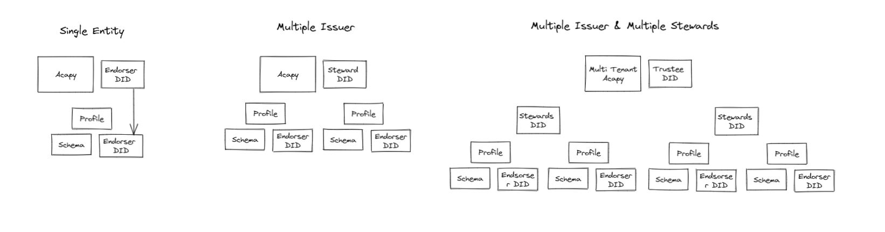

# Operations concept

<!-- TOC GitLab -->

- [General recommendations](#general-recommendations)
- [Security keys and mechanisms](#security-keys-and-mechanisms)
  - [PKCS11](#pkcs11)
    - [Java](#java)
    - [Node.js](#nodejs)
- [Administration configuration concept](#administration-configuration-concept)
  - [Configuration recommendations](#configuration-recommendations)
  - [Different types of DIDs](#different-types-of-dids)
- [Manage notaries](#manage-notaries)
- [TLS certificates](#tls-certificates)
- [Configure profiles](#configure-profiles)
- [Retention periods](#retention-periods)

<!-- /TOC -->

## General recommendations

When setting up the notarization system, make sure that you follow general security requirements and recommendations, like:

- Cryptographic algorithms and TLS cipher suites shall be chosen based on the recommendation from the German Federal Office for Information Security (BSI) or SOG-IS.
- Secrets, such as private keys or passwords, must be stored in secure environments in order to protect their confidentiality and integrity.
  Those environments can be secure enclaves, like TPMs, HSM or secure vaults.
  It may also be possible to store secrets in a third party (e.g., cloud) provider (e.g., secure wallet).
- Keep your software up-to-date.
  You can update the notarization system services by incrementing the version of the services and building new images, shown in [../developer/images.md](../developer/images.md).

## Security keys and mechanisms

The notarization system uses JWKs to encrypt identity data that are assigned to notarization requests.
Those JWKs can be defined for each profile.
In the profile itself, only the public key part is mentioned, which can look like this:

```yml
- name: GAIA-X Employee Credential
    aip: "2.0"
    id: demo-gaia-x-employee-credential-v1
    description: This credential is used for employees in the GAIA-X demonstration.
    notaries:
    - jwk: >
        {
            "kty": "EC",
            "use": "enc",
            "crv": "P-384",
            "kid": "CJVbr_T_rbgAWkP3TBqqbgTO2w27ZWfE_Gsky88odao",
            "x": "s9zwNWhaFk1S_Pm4Ec05wztC5iZ6W1QPemcywckgKk2fXx8IBFC9vTc2x0LatSTC",
            "y": "c9xoL-nBZmifO42GCWnU32uksdg1TF-YmldqxVf_apJ6Yi-bG_cAu0LP3yAqXijw",
            "alg": "ECDH-ES+A256KW"
        }
    valid-for: P1Y
    [...]
```

The private key must be stored by the notary or the notary client in a secure environment.

The notarization system does not distribute secret keys or employ digital certificates.

### PKCS11

The notarization system does not currently integrate with PKCS11.
However, the notarization system consists of microservices developed using Java and Node.JS, which can use pre-existing technologies to implement support for PKCS11.

#### Java

Java provides programming interfaces to directly support [PKCS11](https://docs.oracle.com/en/java/javase/18/security/pkcs11-reference-guide1.html).

With the notarization system, the Java microservices are built on the [Quarkus](https://quarkus.io/) stack, which provides supported integration with [SunPKCS11](https://quarkus.io/guides/security-customization#sun-pkcs11).

#### Node.js

Node.js does not directly support PKCS11, but third-party libraries can provide this functionality, such as [pkcs11js](https://www.npmjs.com/package/pkcs11js).

## Administration configuration concept

### Configuration recommendations

When setting up the notarization system with an Indy ledger using AIP 1.0, you can setup the system in 3 different ways depending on your organization requirements:

- One single organization setup: The system only has one preconfigured issuer which does not change.
  For this setup only one an endorser DID on an Indy ledger such as IDUnion is needed.
- Multi organization setup: The system can dynamically create new issuers.
  For this setup you need to be able to create endorser DIDs by yourself on an Indy network (Node Operator).
- Multi organization setup with Trustee DID.



### Different types of DIDs

The notarization system can be configured with 3 different roles of DIDs with different type of access rights:

- ENDORSER: Schemas, CLAIM_DEF
- STEWARD: Can create new ENDORSER, Schemas, CLAIM_DEF
- TRUSTEE: Can create new ENDORSER, STEWARD, TRUSTEE, Schema, CLAIM_DEF

## Manage notaries

An administrator has to create accounts for the notarization operators in the identity provider (IdP).
A notarization operator is only able to manage notarization requests of profiles where the profile ID is assigned to the operator as role (see [./auth.md](./auth.md) for more information).
In addition, an administrator is able to delete, lock/unlock a notarization operator in the IdP.
A deleted/locked operator does not have access to manage notarization requests.

## TLS certificates

The endpoints of the notarization system can be protected by enabling TLS. For protecting the external endpoints in a Kubernetes deployment, this is done via the [ingress resource](../../deploy/k8s/README.md).
A mesh system such as [Linkerd](https://linkerd.io) or [Istio](https://istio.io/) can protect the internal endpoints.

In general, the certificate validity period should be one year or less.
Certificate owners must ensure that certificates are renewed or replaced before their expiration.

## Configure profiles

Please refer to [profiles.md](profiles.md) for a description of the profiles and their additional components like task-trees and template.
Profiles are managed within the `profile-service`.
For configuration and setup see [./services/profile.md](./services/profile.md).

## Retention periods

In the `request-processing` service, several retention periods can be configured by using these environment variables:

| Environment Variable                                        | Description                                                                                            | Default  |
| ----------------------------------------------------------- | ------------------------------------------------------------------------------------------------------ | -------- |
| NOTARIZATION_PROCESSING_TERMINATED_SESSION_RETENTION_PERIOD | Period when terminated and issued sessions will be deleted.                                            | P1Y      |
| NOTARIZATION_PROCESSING_SESSION_TIMEOUT_PERIOD              | Period when sessions will be deleted where actions of the requestor were needed (like identification). | P1W      |
| NOTARIZATION_PROCESSING_SESSION_SUBMISSION_TIMEOUT_PERIOD   | Period when sessions will be deleted where no request data were submitted.                             | P1D      |
| NOTARIZATION_PROCESSING_HTTP_AUDIT_LOGS_RETENTION_PERIOD    | HTTP audit logs will be deleted after this duration.                                                   | P6Y      |

HTTP audit logs contain respective data for submitted notarization requests.
Data that is submitted for creating a verifiable credential to prove the Gaia-X Compliance Attestation, is retained based on the configured value of the `NOTARIZATION_PROCESSING_HTTP_AUDIT_LOGS_RETENTION_PERIOD` environment variable (by default, 6 years).
