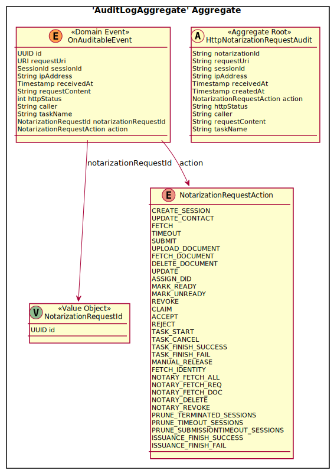
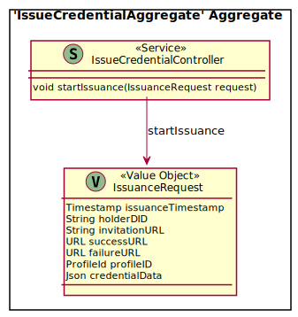
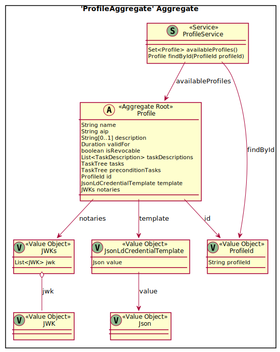

<!-- TOC -->

- [Domain Driven Design](#domain-driven-design)
    - [Notarization Request Processing Domain](#notarization-request-processing-domain)
        - [Submission](#submission)
        - [Management](#management)
        - [Audit](#audit)
        - [Task Processing](#task-processing)
    - [SSI Issuance Domain](#ssi-issuance-domain)
    - [Profile Domain](#profile-domain)
    - [OIDC Identity Resolver Domain](#oidc-identity-resolver-domain)
    - [OpenID Verifiable Credential Domain](#openid-verifiable-credential-domain)
    - [TRAIN Identity Resolver](#train-identity-resolver)
    - [Notifications](#notifications)
- [External](#external)
    - [NotarizationOperatorFrontEnd](#notarizationoperatorfrontend)

<!-- /TOC -->
**Note**: the diagrams are modelled using [Context Mapper](https://contextmapper.org/) in [model.cml](model.cml). To generate the documentation from file, install [jbang](https://www.jbang.dev/) and execute [./generate_diagrams](./generate_diagrams).

# Domain Driven Design

The GAIA-X Notarization system consists of the following bounded contexts, realized as individual micro-services:

- RequestProcessingContext
- SSIIssuanceContext
- IdentificationContext
- SignatureServiceContext
- ProfileContext
- RevocationContext

The following external bounded contexts exist:

- BusinessOwnerFrontEnd
- NotarizationOperatorFrontEnd
- IntegrationTRAINBoundedContext

## Notarization Request Processing Domain

The Notarization Request Processing builds on the following core model:

A Notarization Request follows the given state diagram:

### Submission

The submission of Notarization Requests requires a specialized data model for use by the BusinessOwnerFrontEnd. 

### Management

The management of Notarization Requests requires a specialized data model for use by the NotarizationOperatorFrontEnd.

### Audit

Audit Logging is modelled as:

### Task Processing

Task processing is modelled as:

## SSI Issuance Domain

The SSI Issuance realizes the following aggregate for the issuance of credentials or enrolment of provider entry in trust lists:
  

## Profile Domain

The profile service manages the configured profiles, which define the parameters of a notarization process.

## OIDC Identity Resolver Domain

This micro-service implements a facade to a third-party identity provider with the purpose of identifying a requestor.

## OpenID Verifiable Credential Domain

This micro-service implements a facade to a service that implements the protocols OIDC4VCI and OIDC4VP. Internally, it implements the 

## TRAIN Identity Resolver

This micro-service implements a facade to a TRAIN instance with the purpose of identifying a requestor.

## Notifications

Notifications are sent out to notarization operators to inform them about new notarization requests and to requestors about any updates to their requests.
For this purpose, the message queue system RabbitMQ is used. 

# External

## NotarizationOperatorFrontEnd

There are currently no supported solutions that fulfil the frontend requirement.

This could be fulfilled by:

- a web UI operated by a human notary
- a software agent that 
