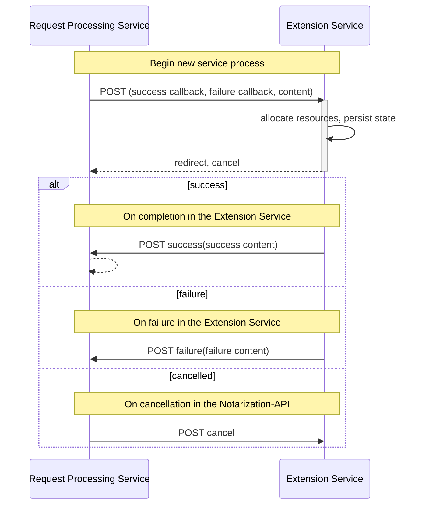
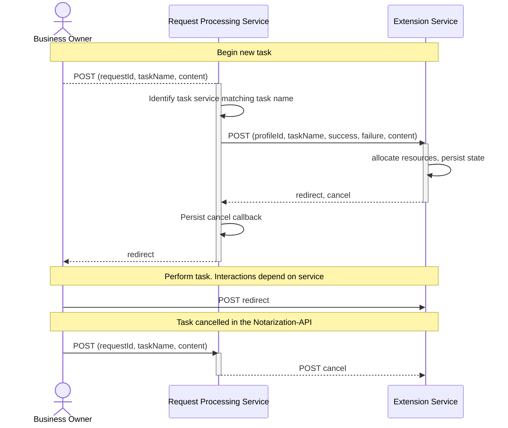
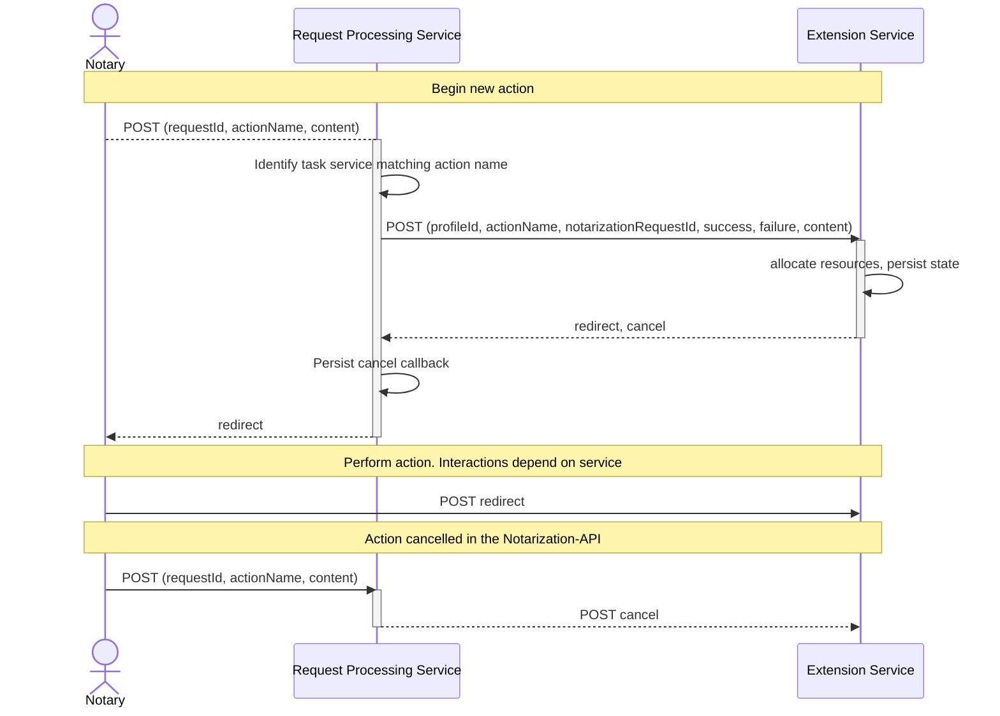
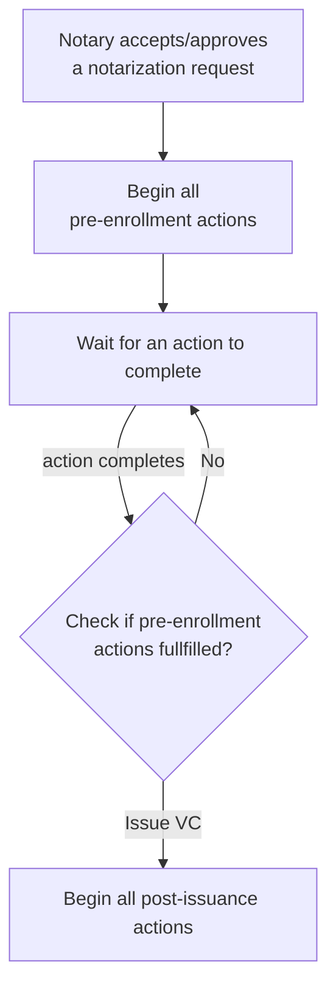

<!-- TOC -->

- [Extension Service API](#extension-service-api)
    - [Tasks](#tasks)
    - [Actions](#actions)
    - [Automation](#automation)
- [Current extension services](#current-extension-services)
- [Configuring a service](#configuring-a-service)
    - [Via application configuration file](#via-application-configuration-file)
    - [Via environment variables](#via-environment-variables)

<!-- /TOC -->


The request submission process and the issuance of the VCs can be configured per profile. These extension services are declared as:

- `tasks`: tasks are performed by the business owner.
- `actions`: actions are performed by the notary or other agents.

The structuring of tasks or actions is described in the profile documentation [../admin/profiles.md](../admin/profiles.md).

## Extension Service API

To implement the Extension Service API, the implementing service must provide two endpoints. The fixed endpoint is used to initiate the use of the service. The second endpoint is given in the response: a service-specific callback provided to cancel the single process.

The OpenAPI specification of the fixed endpoint is [task_service_openapi.yml](task_service_openapi.yml).

The supported interactions between the `request-processing` service and the extension service are presented below:



### Tasks

When an extension service is configured as a task service, the task management is orchestrated by the `request-processing` service.



### Actions

When an extension service is configured as an action service, the action management is orchestrated by the `request-processing` service.



### Automation

The review and approval process will automatically begin the pre-issuance and post-issuance actions, as outlined below:



## Current extension services

The following extension service is implemented directly by the request processing service:

- upload files and validate signatures

The following extension services are provided:

- requestor identification via browser [oidc-identity-resolver](../../services/oidc-identity-resolver/)
- requestor identification via verifiable credentials (VC) in the [ssi-issuance](../../services/ssi-issuance/)
- [train-enrollment](../../services/train-enrollment/)

The configuration of tasks is described in the admin guide for [profiles](../admin/profiles.md).

## Configuring a service

All extension services available a deployment of the Notarization-API must be configured within the `request-processing` service.

The configuration of an extension service requires the following information:

| Type              | Description                                                                                                                      |
| ----------------- | -------------------------------------------------------------------------------------------------------------------------------- |
| `serviceName`     | This name is used to uniquely identify the service within the deployed Notarization-API system.                                  |
| `serviceLocation` | This is the resolvable URL location of the service endpoint that implements the [Extension Service API](#extension-service-api). |
| `description`     | A human readable description of the service (optional).                                                                          |
| `encryptAtRest`       | A boolean value indicating if the success results must be encrypted for the notary.                                              |

The minimum fields required in a profile are: `serviceName`.

If the fields `serviceLocation` or `encrypted` are not declared in the profile, they must be a part of the deployment configuration of the `request-processing` service, matching same service name.

If the built-in service implementing the file upload service is to be used in a deployment, then the name of this task must be configured within the `request-processing` service.

### Via application configuration file

Quarkus supports the application configuration file format to configure properties. 

To configure an extension service for tasks:

```properties
# Replace taskkey with a different key value for each task service

# The full, resolvable location of the task extension service
gaia-x.extensions.tasks.taskkey.location = 
# The name used to match and identify this configuration against the task descriptions in any profile
gaia-x.extensions.tasks.taskkey.service-name = 
# A comma-separated list of task description names used to explicitly match and identify this configuration for any profile
gaia-x.extensions.tasks.taskkey.names = 
# Declare if the results of a task must be encrypted in the database.
gaia-x.extensions.tasks.taskkey.encrypt-at-rest = 
```

To configure an extension service for actions:

```properties
# Replace actionkey with a different key value for each action service

# The full, resolvable location of the action extension service
gaia-x.extensions.actions.actionkey.location = 
# The name used to match and identify this configuration against the issuance action in any profile
gaia-x.extensions.actions.actionkey.service-name = 
# A comma-separated list of issuance action names used to explicitly match and identify this configuration for any profile
gaia-x.extensions.actions.actionkey.names = 
# Declare if the results of a action must be encrypted in the database.
gaia-x.extensions.actions.taskactionkeykey.encrypt-at-rest = 
```

Further links:

- [Quarkus configuration via application property file](https://quarkus.io/version/3.8/guides/config-reference#application-properties-file)


### Via environment variables


Quarkus supports the application configuration file format to configure properties. 

To configure an extension service for tasks:

```properties
# Replace TASKKEY with a different key value for each task service

# The full, resolvable location of the task extension service
GAIA_X_EXTENSIONS_TASKS_TASKKEY_LOCATION = 
# The name used to match and identify this configuration against the task descriptions in any profile
GAIA_X_EXTENSIONS_TASKS_TASKKEY_SERVICE_NAME = 
# A comma-separated list of task description names used to explicitly match and identify this configuration for any profile
GAIA_X_EXTENSIONS_TASKS_TASKKEY_NAMES = 
# Declare if the results of a task must be encrypted in the database.
GAIA_X_EXTENSIONS_TASKS_TASKKEY_ENCRYPT_AT_REST = 
```

To configure an extension service for actions:

```properties
# Replace ACTIONKEY with a different key value for each action service

# The full, resolvable location of the action extension service
GAIA_X_EXTENSIONS_ACTIONS_ACTIONKEY_LOCATION = 
# The name used to match and identify this configuration against the issuance action in any profile
GAIA_X_EXTENSIONS_ACTIONS_ACTIONKEY_SERVICE_NAME = 
# A comma-separated list of issuance action names used to explicitly match and identify this configuration for any profile
GAIA_X_EXTENSIONS_ACTIONS_ACTIONKEY_NAMES = 
# Declare if the results of a action must be encrypted in the database.
GAIA_X_EXTENSIONS_ACTIONS_ACTIONKEY_ENCRYPT_AT_REST = 
```

Further links:

- [Quarkus configuration via environment variables](https://quarkus.io/version/3.8/guides/config-reference#environment-variables)
