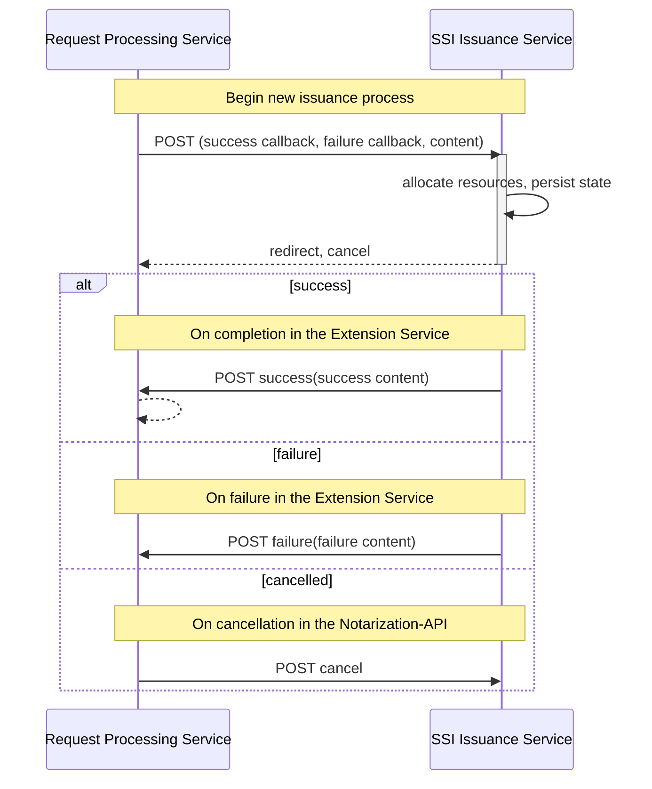
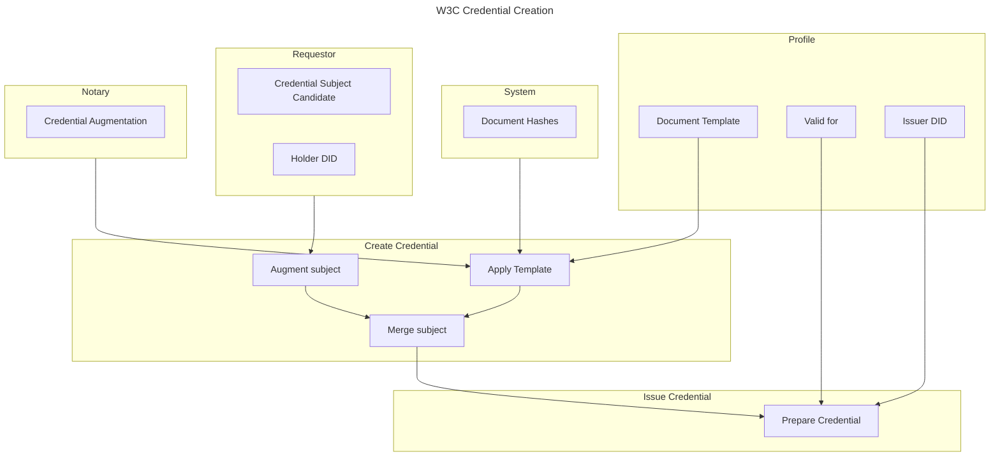

<!-- TOC -->

- [Extension SSI-Issuance Services](#extension-ssi-issuance-services)
    - [Extension Service API](#extension-service-api)

<!-- /TOC -->

# Extension SSI-Issuance Services

The structuring of tasks or actions is described in the profile documentation [../admin/profiles.md](../admin/profiles.md).

## Extension SSI-Issuance API

To implement the Extension Service API, the implementing service must provide two endpoints. The fixed endpoint is used to initiate the use of the service. The second endpoint is given in the response: a service-specific callback provided to cancel the single process. 

The OpenAPI specification of the fixed endpoint is [task_service_openapi.yml](task_service_openapi.yml)

The supported interactions between the `request-processing` service and the extension service are presented below:

