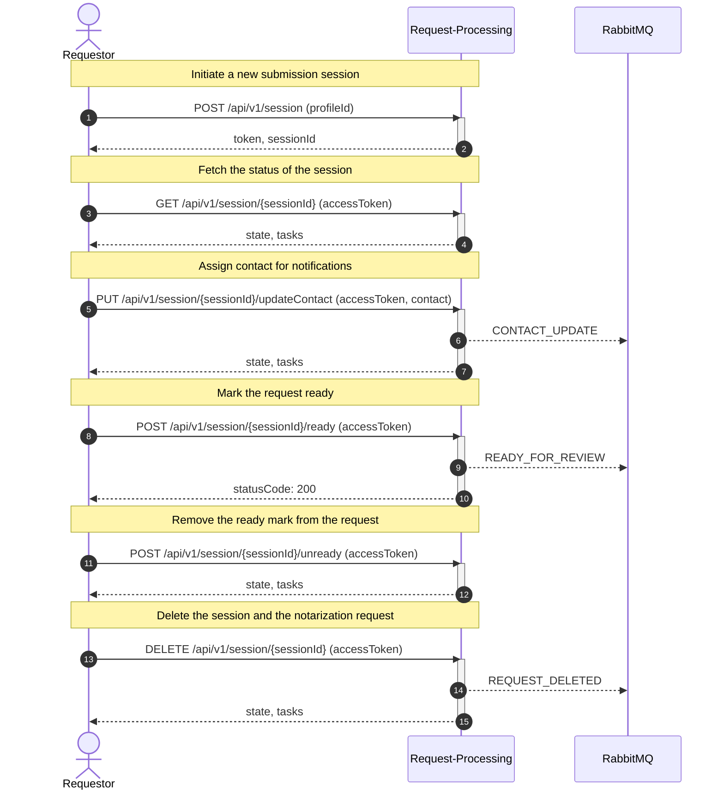
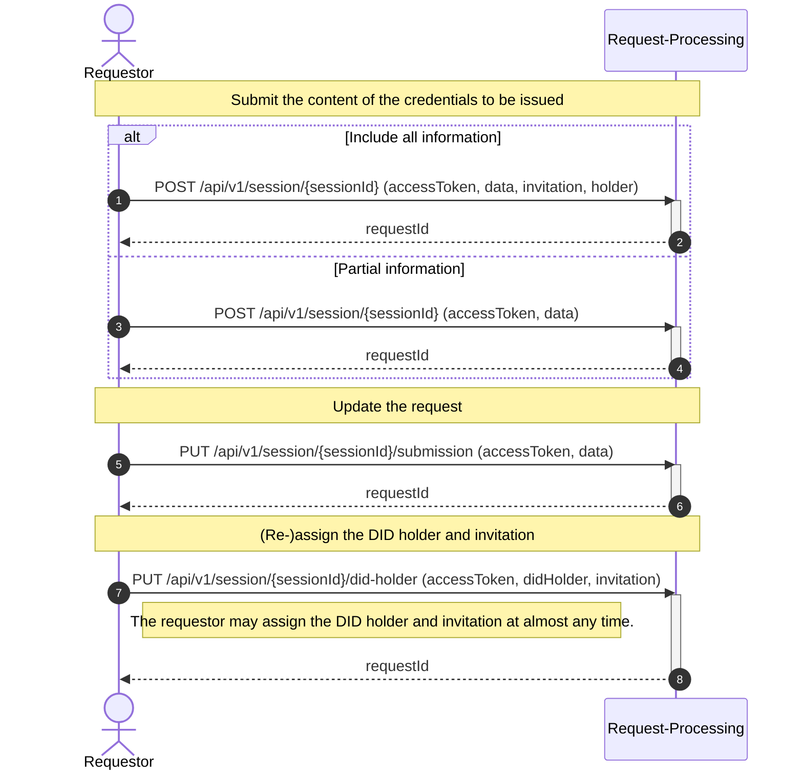
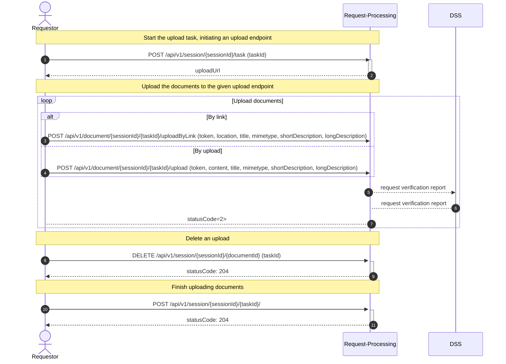

# Processes

<!-- TOC GitLab -->

- [Session Management](#session-management)
- [Request submission content management](#request-submission-content-management)
- [Upload evidence documents](#upload-evidence-documents)

<!-- /TOC -->

## Session Management

These calls demonstrate how administrative operations are executed.

## Request submission content management

These calls submit the request-specific content.

## Upload evidence documents

These calls demonstrate the submission of evidence documents.

