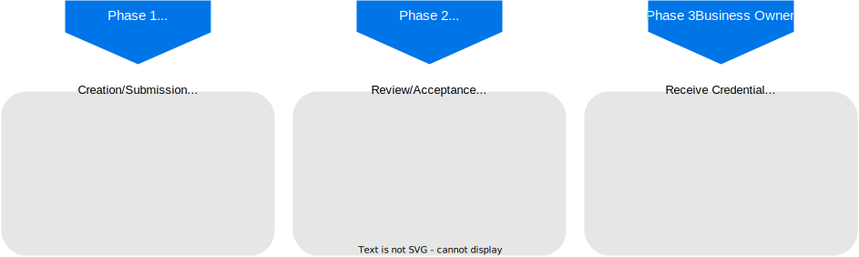

# Usage Guide

<!-- TOC GitLab -->

- [Overview](#overview)
- [Process](#process)
  - [Creation/Submission](#creationsubmission)
  - [Review/Acceptance](#reviewacceptance)
  - [Accepting and actions](#accepting-and-actions)
  - [Receive credential](#receive-credential)
- [Examples](#examples)
- [Profiles](#profiles)
- [Supported wallets](#supported-wallets)
- [Events](#events)

<!-- /TOC -->

## Overview

The notarization API allows the creation of `notarization requests` by a business owner to gather credentials containing claims approved by a notary.
The business owner can therefore provide data which should be contained in the final credential and can provide documents and information to allow a notary the verification and the approval of that data.

## Process

The process from request to the issuance of a credential can be divided in three phases:



[comment]: # (https://viewer.diagrams.net/?tags=%7B%7D&highlight=0000ff&edit=_blank&layers=1&nav=1#R7VhtT9swEP41FdskJqfp60daKPswNkZBSPsymeSaeHXs4Dgt5dfvnDgkbQokEgImESQUP747J3fPPXbacafR3amicXgmfeCdLvHvOu5xp9sd9Xr43wCbHBg4%2FRwIFPNzyCmBObsHCxKLpsyHZMtQS8k1i7dBTwoBnt7CqFJyvW22kHx71ZgGUAPmHuV19Jr5OrSoQ0g58Q1YENqlR307cUO9ZaBkKux6QgrIZyJahLGmSUh9ua5A7knHnSopdX4X3U2Bm6wWGcv9Zo%2FMPjyyAqGbOPTAGw9v%2FDH0%2FS5xuqNDW6IV5alNQ6c74Bhr4rMV3gbm9jykCb4RcYo5XKAyvcdjkiZMQJKg08%2B1AFWY3Khdp91QWZb0pigKJiw2t3KxOMf8T%2FPaS4W265BpmMfUM%2FNrpCRioY44jhy8XTDOp5IbUwzkEjLsn4wMLoW25EOC5uOK3Sy7EE9yG%2FLVGK1AaYZUOeIsEIhqaVZLtJJLKJyzshevUC2JrZKJAXcVyJboFGQEWm3QpJjtWbrYTnJdO15XeDmwWFih5NBi1LZC8BC65ATeWFo0pIgzeJQjoVMU7gJWDNYY%2B8jzINZUYFWeqnnpucUeQm2CEb1NTVdMOCx0Odr1SvkuwlmBTDllEcYUUlPF7qlmUuBQwW0Kia48TOlSD1K8GPGppq19pJdGyIOkrSMqodBMb9qtm%2BcejS7gr1HI2rvuLUU9IoL1vD7TqEhtvd2ACbYmEwGO%2BuXo0jTO8SHK1P4GltglC55JZMh8zMJjbZaDhVC79YY%2FGZi%2FnYZ36w1Psgvxgnoeph6MwGSSDr59nRfoa3e83de9PX3tkj197YxeoLE3MBP6uvfnavIrVLH8HZHp4WG3jf67jfX%2Fh2m5TXPVrwX4rzcMMnaHfWIv5%2FX3j97gDfePvTRzHj9nVPcQD9jKEG2qIBNAyt98E7lULAjMAYawJEnzfY18krHZTCj%2F3FJZS%2BQUj4ZZ2AMmVkwXm9PVxfeDvQs8L9RfzFFUYn1NP0Bszl4eFVk6EmkKTeMYsnGqJZ5MDR95ix79EPzWjTh03p3gP3Gaa674zY%2F3H5L%2BQkwavatPgl4DOUcRt6o2m6c3EcpnNnjdTwDzDIbI1FAK7CMQip%2FqqI6hlBnLYyWRKfCk1JYISq7hVeYHnhQ%2Bs9qtabJsetLPMqLbHe%2FLhamfL2r2x1bLnlG1NC4hVD8ODDnMkPqbJ%2BM0%2Bi7I0bhR11esPnaX9prwipsLDstfqbK5yo%2BA7sk%2F)

### Creation/Submission

The creation of a `notarization request` is the first phase in which a business owner creates the request, submits the data to be contained in the credential, and provides additional information to be verified.
The phase is starting by the creation of a `session` providing a `profile identifier`.
The `profile identifier` defines a profile which describes conditions and constraints for the process and the resulting credential.
See [Profiles](#profiles) for a detailed description.

If the profile contains `precondition-tasks`, those define the next steps which have to be performed by the business owner.
To fulfill a task it has to be started by calling the corresponding endpoint providing the `taskid`.
It depends on the task how its fulfillment happens.
In the case of uploading documents, after uploading documents, a call to the `finishTask` endpoint can be used to tell the system, that all required documents were provided.
When an identification is performed, the task will be automatically finished after a successful authentication.

The state of the `notarization request` and fulfilled tasks can always be requested via the API.

If the preconditions are fulfilled or no precondition was defined by the profile, the next step for the business owner is to provide the data which should be contained in the resulting credential.
Since this step is necessary for any `notarization request`, it is not included as a task, but has a dedicated API endpoint.
However, if the profile defines preconditions, the submission of the data is possible only after the preconditions are fulfilled.
In addition to the data, an invitation URL can be included for a verifiable credential issuance, which will be used in phase 3 to provide the resulting credential.
If none is given at this point, the business owner can get an invitation URL after the successful issuance via the API.
The holder DID must also be included with the data.

Further there also might be additional tasks defined in the profile, which can be fulfilled at any time during the process after the preconditions are fulfilled.
The procedure is analogous to the fulfillment of the precondition tasks described above.

Once all precondition tasks are fulfilled, the submission of the data is performed and all tasks are fulfilled, the business owner can mark the `notarization request` as `ready`, with the corresponding API call.
During the `markReady` call the option `manualRelease` can be set.
This means that after a notary accepts a `notarization request`, the issuance is not performed automatically, but has to be triggered by the business owner via the API.
Marking the request as `ready` marks the end of phase one.

### Review/Acceptance

Once a `notarization request` is marked as ready, it will be available for review by notaries.
A notary can always gather available requests like these via the API.
By claiming a `notarization request`, the notary tells the system, that the review of the request is in progress.
After that the notary can request the data, sent by the business owner, download and view the uploaded documents and can request the identity data which are gathered from the authentication process performed by the business owner, via the provided endpoints.
Note that a notary will only be allowed to get information about a `notarization request`, if he is associated with the profile under which the requests are created.
After reviewing all provided information the notary can decide to either accept or revoke the request.
In the case of revocation the business owner will get notified and may alter or change provided information, if for example a document is missing.
However, there is also an endpoint allowing the notary to directly delete a `notarization request`.
If the notary accepts a `notarization request`, phase two is over.

### Accepting and actions

After a notary accepted the `notarization request`, a verifiable credential can be issued.

### Receive credential

If the business owner set the option for `manual release`, the issuance has to be triggered via calling the associated endpoint.
Otherwise, it is issued automatically.
If the business owner provided an `invitation URL` from an owned credential wallet with the submitted data, the credential will be sent to the wallet via this URL.
Otherwise, the business owner can get a generated `invitation URL` by the associated endpoint and can use it to fetch the credential.

> **Note**
>
> Technical definitions of the API and the specific requests can be found in the [OpenAPI documents for `request-processing`](https://gitlab.com/gaia-x/data-infrastructure-federation-services/not/notarization-service/-/jobs/artifacts/main/download?job=openapi-request-processing).
> The endpoints are grouped in two main categories matching phase 1 and 2, namely `submission` for phase 1 and `management` for phase 2.
> Phase 3 doesn't need much interaction and has no separate category.

## Examples

Some example interactions are available in the following Postman collection in [../e2e/postman](../e2e/postman).

## Profiles

When a business owner wants to submit a `notarization request`, a profile must be chosen.
Such a profile defines

- the types of verifiable credentials that may be issued,
- the submission process defined for the business owner,
- the issuance actions defined for the notary

In general, it will be distinguished between two kinds of tasks.
`Precondition tasks` must be fulfilled before any data can be submitted and normal `tasks` that has to be fulfilled before a `notarization request` can be marked as ready.
An example of a `precondition task` is the identification of the business owner.
A normal `task` can be the upload of documents.

In the `template` section of a profile, the schema of the JSON data that are passed in a notarization request is defined.
For AIP 1.0, this can look similar to:

```yaml
    template: >
        {
            "attributes": [
                "Claims",
                "FederationName",
                "EmpId",
                "FederationId",
                "EmpEmail",
                "EmpFirstName",
                "EmpLastName"
            ]
        }
```

Then, a `notarization request` for this template can look like the following:

```json
{
    "data": {
        "Claims" : "admin",
        "FederationName" : "Simple Federation",
        "EmpId" : "5989240124",
        "FederationId": "30129",
        "EmpEmail" : "example@email.com",
        "EmpFirstName" : "Jane",
        "EmpLastName" : "Doe"
    },
    "holder": "did:key:z6MkokM7AWa3dQvhtyLKPp2b4SsHTrAy4CWqquUA9Bmd8Khy",
    "invitation": "http://own.wallet?c_i=eyJAdHlwZSI6ICJkaWQ6c292OkJ"
}
```

More information about profiles and their setup can be found in [./admin/profiles.md](./admin/profiles.md).

## Supported wallets

The Notarization API uses internally [Aries Cloudagent Python](https://github.com/hyperledger/aries-cloudagent-python) (also known as ACA-Py) to issue credentials and store key material for the created DIDs. This imposes some limitations in terms of supported counter-party wallets. Basically, any wallet/agent which is interoperable with ACA-Py, could be a holder of credentials issued by the Notarization API.

Below is a list of [Aries Protocols](https://github.com/hyperledger/aries-rfcs) used by the [SSI service](admin/services/ssi.md) of the Notarization API:

| Protocol                                                                                                                       | Usage                                                                                                                                                                                                                                                                                                                                              |
|--------------------------------------------------------------------------------------------------------------------------------|----------------------------------------------------------------------------------------------------------------------------------------------------------------------------------------------------------------------------------------------------------------------------------------------------------------------------------------------------|
| [0160: Connection Protocol](https://github.com/hyperledger/aries-rfcs/blob/main/features/0160-connection-protocol/README.md)   | Used to establish connection between two agents. This protocol could be initiated by both parties.                                                                                                                                                                                                                                                 |
| [0036: Issue Credential 1.0](https://github.com/hyperledger/aries-rfcs/blob/main/features/0036-issue-credential/README.md)     | This protocol is part of [Aries Interop Profile 1.0](https://github.com/hyperledger/aries-rfcs/blob/main/features/0036-issue-credential/README.md). The protocol is used to issue Anoncreds to requesters.                                                                                                                                         |
| [0037: Present Proof 1.0](https://github.com/hyperledger/aries-rfcs/blob/main/features/0037-present-proof/README.md)           | This protocol is part of [Aries Interop Profile 1.0](https://github.com/hyperledger/aries-rfcs/blob/main/features/0036-issue-credential/README.md). The protocol is used to verify credentials issued using the [Issue Credential 1.0](https://github.com/hyperledger/aries-rfcs/blob/main/features/0036-issue-credential/README.md) protocol      |
| [0454: Present Proof 2.0](https://github.com/hyperledger/aries-rfcs/blob/main/features/0454-present-proof-v2/README.md)        | This protocol is part of [Aries Interop Profile 1.0](https://github.com/hyperledger/aries-rfcs/blob/main/features/0036-issue-credential/README.md). This protocol is used to verify credentials issued using the [Issue Credential 2.0](https://github.com/hyperledger/aries-rfcs/blob/main/features/0453-issue-credential-v2/README.md) protocol. |
| [0453: Issue Credential 2.0](https://github.com/hyperledger/aries-rfcs/blob/main/features/0453-issue-credential-v2/README.md)  | This protocol is part of [Aries Interop Profile 2.0](https://github.com/hyperledger/aries-rfcs/blob/main/concepts/0302-aries-interop-profile/README.md#aries-interop-profile-version-20). The protocol is used to issue W3C Credentials (JSON-LD) to requesters.                                                                                   |

The following DID methods are supported:

- [`key`](https://w3c-ccg.github.io/did-method-key/)
- [`sov`](https://sovrin-foundation.github.io/sovrin/spec/did-method-spec-template.html)

## Events

On various actions, events are published, for example when a request is ready for review, a request is accepted or rejected by the notary, ... Those events are published over two channels, for more information about those events, see [./developer/notification-mechanism.md](./developer/notification-mechanism.md).
