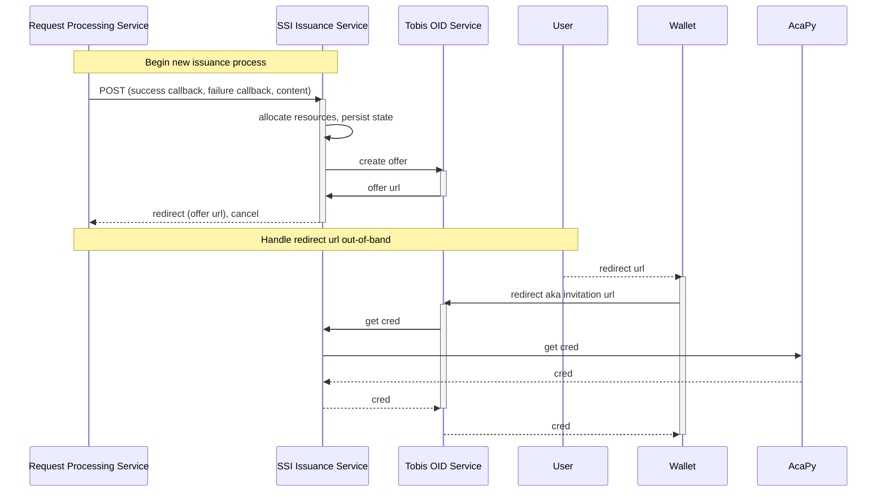

### OID4VC SSI Issuance Service

```mermaid
sequenceDiagram
participant ReqSub as Request Processing Service
participant IssuanceService as SSI Issuance Service
participant OIDService as Tobis OID Service
participant User
participant Wallet

Note over ReqSub, IssuanceService: Begin new issuance process
ReqSub->>IssuanceService: POST (success callback, failure callback, content)
activate IssuanceService
IssuanceService->>IssuanceService: allocate resources, persist state
IssuanceService->>OIDService: create offer
activate OIDService
OIDService->>IssuanceService: offer url
deactivate OIDService
IssuanceService-->>ReqSub: redirect (offer url), cancel
deactivate IssuanceService
Note over ReqSub, User: Handle redirect url out-of-band

User-->>Wallet: redirect url
activate Wallet
Wallet->>OIDService: redirect aka invitation url
activate OIDService
OIDService->>IssuanceService: get cred
IssuanceService->>AcaPy: get cred
AcaPy-->>IssuanceService: cred
IssuanceService-->>OIDService: cred
deactivate OIDService
OIDService-->>Wallet: cred
deactivate Wallet
```

